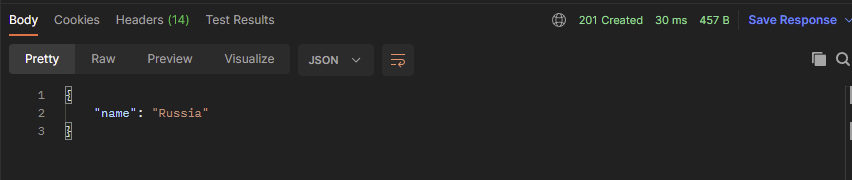

### Метеорологическая компания собирает данные о погоде в некоторых городах с помощью сенсеров. Данные с помощью REST пересылаются в формате JSON.
### Замер давление происходит в определенном районе и занимает 1 час, если в течение этого времени погода не испортилась, то значение становится false.
### Данную статистику необходимо собрать, какая в каждом районе была погода и вернуть количество.
### Данные о районах проведения замера указаны как уникальное значение.

## Стек технологий:


## Контакты
[](https://t.me/romanka3)

### chansforman@gmail.com

## Перед запуском установите:

- Java 17
- Apache Maven 3.x
- Postgres 14
- Postman

## Запуск приложения

1. Создать бд:
```sql
create database weather_changer_v;
```

2. Запуск приложения с maven. Перейдите в корень проекта через командную строку и выполните команды:
```
    mvn clean install
    mvn spring-boot:run
```
 

3. Введите команду http://localhost:8080/cities/addCity POST

 

Будет возвращено:


При повторной попытке зарегистрировать одинаков значение будет выведено исключение


Введите команду http://localhost:8080/country/addCountry POST


Будет возвращено:



Введите команду http://localhost:8080/streets/addStreet POST


Будет возвращено:


 Введите команду http://localhost:8080/sensors/registration POST


В ответ на запрос будет получен ответ


 Введите команду http://localhost:8080/measurements/add POST


 В ответ на запрос придет 


 Введите команду http://localhost:8080/measurements/rainyDaysCount GET


 В ответ на запрос придет

 

 Значение будет 0 т.к данные дни отсутствуют

 Введите команду http://localhost:8080/measurements/allMeasurement


 В ответ на запрос придет список всех элементов 

 Введите команду http://localhost:8080/users/registration POST


В ответ придет сообщение

 